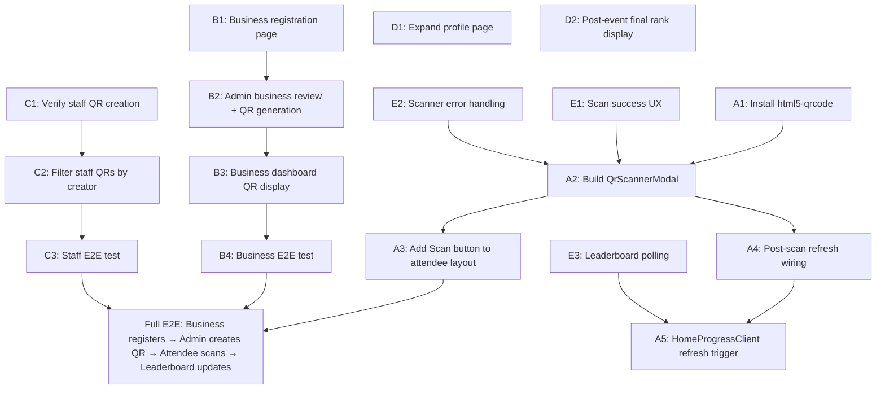

# Implementation Plan: Base Version Functional Completion

> **Goal**: Take the existing codebase from its current state (login/role-entry works, pages exist as shells, backend scoring engine is built) to a **fully functional base version** where all four roles (Attendee, Admin, Staff, Business) can exercise the core QR → points → leaderboard loop end-to-end.

---

## What Already Works

| Layer | Status |
|---|---|
| **Auth / Login** | ✅ Role entry page with dummy emails, magic-link sign-in, Supabase session, RBAC middleware (Attendee, Admin, Staff — Business login to be added) |
| **Attendee shell** | ✅ 5-tab nav (Home, Agenda, Geeks, Rewards, Leaderboard), home progress card with score/rank/spendable/rewards |
| **Admin shell** | ✅ Layout with nav (Events, Businesses, QR, Exports, Notifications, Ops), QR campaign create form + campaign list with QR images |
| **Staff shell** | ✅ Layout with QR Operations link, QR campaign create form + campaign list with QR images |
| **QR image generation** | ✅ `ScanQrCode` component renders QR via `qrcode` library on admin/staff campaign cards |
| **Backend scoring engine** | ✅ Full `awardScan` with idempotency, rate limiting, Redis cache, advisory locks, dual-ledger update, audit log |
| **Scan landing page** | ✅ `/{eventSlug}/scan/{code}?sig=...` — auto-awards on page load, shows result |
| **Leaderboard** | ✅ Backend `GET /leaderboard` returns top-10 + own rank; client polls every 15s on home page |
| **DB schema** | ✅ All SQL migrations (0000–0010) applied — `qr_codes`, `scan_records`, `attendees`, `businesses`, leaderboard index |

---

## What's Missing (The Gap)

### 1. Attendee: No Camera-Based QR Scanner
The attendee can only receive points by **navigating to a scan URL** (e.g. typing it or clicking a link). There is **no camera scanner** in the app — the attendee has no button to open their phone camera, point it at a physical QR code, and have the scanned URL processed automatically.

### 2. Business: No Self-Registration or QR Visibility
Businesses currently have no way to register themselves. The existing `POST /admin/businesses` backend route assumes admin creates businesses, but the new flow requires **businesses to self-register** through their own dedicated login/signup page. After registration, the admin reviews them and explicitly generates a QR code. That QR must then appear on the **business's own authenticated dashboard**. None of this exists yet — no business auth, no registration form, no business dashboard, and no admin QR-generation-on-demand UI.

### 3. Staff: Dynamic QR Persistence Visibility
Staff can create QR campaigns via the UI form, but the **"visible on staff's profile"** requirement means all QRs created by the logged-in staff member should be clearly listed and persisted across sessions, with scan counts updating live.

### 4. Profile Page is a Stub
The attendee profile page is a placeholder. It needs to show the attendee's **final points, rank, email, alias**, and post-event archive state.

### 5. Leaderboard Not Refreshing After Scan
After a scan awards points, the attendee is on the scan result page — but there's no immediate navigation or refresh trigger to update the home page progress card or leaderboard client.

---

## Implementation Phases

### Phase A: Attendee QR Scanner (High Priority)

This is the **single biggest missing feature** — the attendee currently has no way to scan a QR code with their camera.

#### A1. Install `html5-qrcode` Library

```bash
cd apps/web
pnpm add html5-qrcode
```

> [!NOTE]
> `html5-qrcode` provides a browser-native camera QR scanner with no native dependencies. It works on all modern mobile browsers.

#### A2. Create `QrScannerModal` Component

**File**: [apps/web/lib/qr-scanner-modal.tsx](file:///c:/Users/Admin/Desktop/sales-geeks-expo-v1/apps/web/lib/qr-scanner-modal.tsx)

Build a client component that:
- Opens as a full-screen modal overlay
- Requests camera permission via `Html5Qrcode`
- On successful decode, extracts the URL path from the scanned QR content
- Parses the path to get the `code` and `sig` query params
- Calls the existing `POST /api/scan/{code}` endpoint with `{ event_id, sig }`
- Displays the award result (points earned, new score, or "already collected")
- Provides a "Scan Another" button and a "Close" button
- Handles errors gracefully (camera denied, invalid QR, network failure)

**Key design decisions:**
- The scanner should extract the relative path from the full URL (since QRs encode absolute URLs like `https://domain/sge-2026/scan/abc123?sig=xyz`)
- Parse out `code` from the path and `sig` from query params
- Reuse the existing `POST /api/scan/[code]` Next.js API route (which proxies to the backend)

#### A3. Add "Scan QR" Button to Attendee Layout

**File**: [apps/web/app/[eventSlug]/(attendee)/layout.tsx](file:///c:/Users/Admin/Desktop/sales-geeks-expo-v1/apps/web/app/%5BeventSlug%5D/%28attendee%29/layout.tsx)

- Add a prominent floating action button (FAB) or a 6th element in the bottom nav
- **Recommended**: A floating circular button positioned above the bottom nav bar (bottom-right or center)
- On click, opens the `QrScannerModal`
- Pass `eventId` and `eventSlug` as props so the modal can call the scan API

#### A4. Post-Scan Navigation / Refresh

After a successful scan:
- Show the "+X points" result in the scanner modal
- When the user closes the modal, trigger a refresh of the `HomeProgressClient` data
- Option 1: Use `router.refresh()` if on the home page
- Option 2: Use a shared state signal (React context or simple event emitter) so the progress card re-fetches
- The leaderboard page already polls, so it will update on next cycle (every 15s), but we should also add a manual refresh trigger

#### A5. Update `HomeProgressClient` for Immediate Refresh

**File**: [apps/web/app/[eventSlug]/(attendee)/home/home-progress-client.tsx](file:///c:/Users/Admin/Desktop/sales-geeks-expo-v1/apps/web/app/%5BeventSlug%5D/%28attendee%29/home/home-progress-client.tsx)

- Expose the `load()` function via a ref or context so the scanner modal can trigger an immediate data reload
- Alternatively, reduce the polling interval temporarily after a scan (e.g. poll at 2s for the next 10s)

---

### Phase B: Business Self-Registration + Admin QR Generation

Businesses have their own separate registration flow. They sign up through a dedicated login page, fill in their business details, and land on a business profile. The admin then reviews registered businesses and explicitly generates a QR for each one. The QR appears on the business's profile once created.

#### B1. Business Registration Page

**Files to create/build**:
- `apps/web/app/(business)/login/page.tsx` — separate business login/signup page
- `apps/web/app/(business)/register/page.tsx` — business registration form
- `apps/web/app/(business)/dashboard/page.tsx` — business profile/dashboard
- `apps/web/app/(business)/layout.tsx` — business-specific layout with nav

The business registration page collects:
- Business name (required)
- Contact person name (required)
- Contact email (required, used for auth — immutable after signup)
- Phone number
- Business description / tagline
- Logo upload (optional)
- Website URL (optional)
- Event selection (which event they're exhibiting at)

**Auth**: Businesses authenticate via Supabase Auth email OTP (same mechanism as attendees, different entry point). Their `public.users` row has `type = 'business'`. The registration form creates both the `auth.users` entry and the `businesses` row in a single transaction.

**Business profile state**: After registration, the business profile shows their details but has a "QR Pending" status — no QR code is visible until the admin generates one.

#### B2. Admin Business Review + QR Generation

**Files to check/build**:
- [apps/web/app/(admin)/admin/businesses/](file:///c:/Users/Admin/Desktop/sales-geeks-expo-v1/apps/web/app/%28admin%29/admin/businesses/)

The admin businesses page must:
- Show a list of all self-registered businesses with their details and registration date
- Each business card shows its current status: **"Registered — No QR"** or **"Active — QR Generated"**
- For businesses without a QR: show a "Generate QR" button with a points field
- On clicking "Generate QR": admin sets the point value, the backend creates a `qr_codes` row with `owner_type = 'business'` and the specified points
- The QR is HMAC-signed: `/{eventSlug}/scan/{code}?sig={signature}`
- One QR per business per event, enforced by the `qr_codes_one_business_qr_idx` unique index
- Once generated, the QR image is rendered on the admin's business card AND becomes available on the business's own profile

**Backend changes**: The `POST /admin/businesses` route is no longer the way businesses are created — businesses self-register. Instead, add:
- `POST /admin/businesses/:id/generate-qr` — admin-only endpoint that creates the QR for a registered business
- `GET /business/profile` — business-authenticated endpoint that returns their own profile including QR (if generated)

> [!IMPORTANT]
> QR generation is a **separate, explicit admin action** — NOT auto-generated on business registration. This gives the admin a review/approval gate before a business gets a scannable QR.

#### B3. Business Dashboard — QR Display

Once the admin generates a QR for a business, the business's authenticated dashboard should:
- Show the QR code rendered as an image (using the existing `ScanQrCode` component)
- Display the point value associated with the QR
- Show scan statistics (total scans, unique attendees) — read-only
- Provide a downloadable/printable version of the QR card (branded, same `@vercel/og` print cards from the existing QR print system)

If no QR has been generated yet, show a clear "QR Pending — Your QR code will be available once approved by the event admin" message.

#### B4. End-to-End Verification

Test the full loop:
1. Business registers through the business signup page with their details
2. Business appears in the admin's business list with "Registered — No QR" status
3. Admin clicks "Generate QR" and sets 20 points
4. Business QR is generated and displayed in admin UI
5. Business logs into their dashboard → sees their QR code with 20 points
6. Attendee opens scanner → scans the business QR
7. Backend `awardScan` processes the scan → +20 competition_score, +20 spendable_balance
8. Attendee's home progress card updates
9. Leaderboard re-ranks the attendee
10. Business dashboard shows updated scan count

---

### Phase C: Staff Dynamic QR Creation

#### C1. Verify Staff QR Creation Flow

**File**: [apps/web/app/(staff)/staff/qr/staff-qr-client.tsx](file:///c:/Users/Admin/Desktop/sales-geeks-expo-v1/apps/web/app/%28staff%29/staff/qr/staff-qr-client.tsx)

The staff QR creation form already exists and calls `POST /staff/qr-campaigns`. Verify:
- Created QRs are persisted to the `qr_codes` table with `owner_type = 'misc'`
- The campaign list reloads after creation and shows the new QR with its rendered image
- The `created_by_user_id` is set to the staff user's ID so we can filter by creator

#### C2. Filter Staff QRs by Creator

**Backend change** in [apps/backend/src/http/businesses.ts](file:///c:/Users/Admin/Desktop/sales-geeks-expo-v1/apps/backend/src/http/businesses.ts) (`listQrCampaigns` function):

For the staff endpoint (`GET /staff/qr-campaigns`), add a filter:
```sql
WHERE created_by_user_id = {actor.id}
```

This ensures each staff member only sees **their own** dynamically created QRs, not all QRs in the system. Admin should continue to see all QRs.

> [!IMPORTANT]
> This is a key behavioral difference: staff sees only their own QRs, admin sees all QRs system-wide.

#### C3. Staff QR Scan Verification

Confirm that a QR created by staff follows the same scan→award path:
1. Staff creates a "Guest Speaker" QR with 15 points for speaker "John Doe"
2. QR code appears in staff's campaign list with rendered image
3. Attendee scans this QR → +15 points awarded
4. Staff's campaign card shows updated scan count and unique attendee count

---

### Phase D: Profile Page & Post-Event Display

#### D1. Expand Profile Page

**File**: [apps/web/app/[eventSlug]/(attendee)/profile/page.tsx](file:///c:/Users/Admin/Desktop/sales-geeks-expo-v1/apps/web/app/%5BeventSlug%5D/%28attendee%29/profile/page.tsx)

Replace the stub with a full profile view showing:
- **Email** (immutable, from Supabase auth)
- **Alias** (from attendee record)
- **Competition Score** (final points)
- **Leaderboard Rank** (current or final)
- **Spendable Balance** (remaining)
- **Check-in status** and **verification status**
- **Scan history**: list of all QR codes scanned with points earned (from `scan_records` joined with `qr_codes`)

#### D2. Post-Event Final Rank Display

When the event lifecycle transitions to `post_event` or `archived`:
- The profile page should prominently display the **final rank and score**
- The leaderboard tab should show the frozen final standings
- Both are already handled by the backend (the leaderboard query works regardless of lifecycle state), but the UI should add a "Final Results" banner

---

### Phase E: Cross-Cutting Polish

#### E1. Scan Success Feedback UX

After a successful scan in the `QrScannerModal`:
- Show an animated "+20 points!" confirmation
- Briefly show the new total score
- Auto-close after 3 seconds or on tap
- Haptic feedback on mobile (if supported via `navigator.vibrate`)

#### E2. Error Handling in Scanner

Handle these cases gracefully in the scanner UI:
- **Camera permission denied**: Show instructions to enable camera
- **Invalid QR** (not a SalesGeek URL): Show "This QR code is not for this event"
- **Already scanned**: Show "You've already scanned this one" (from `already_collected` status)
- **QR not active / expired**: Show the appropriate message from the backend
- **Network error**: Show retry button with "Check your connection"

#### E3. Leaderboard Polling Enhancement

Update [leaderboard-client.tsx](file:///c:/Users/Admin/Desktop/sales-geeks-expo-v1/apps/web/app/%5BeventSlug%5D/%28attendee%29/leaderboard/leaderboard-client.tsx):
- Add a `useEffect` polling interval (similar to home progress — currently it only fetches once)
- Add a manual "Refresh" button
- Animate rank changes with a subtle transition

---

## Task Dependency Graph



---

## Suggested Build Order

| Order | Task | Est. Effort | Depends On |
|---|---|---|---|
| 1 | **A1** — Install `html5-qrcode` | 5 min | — |
| 2 | **A2** — Build `QrScannerModal` component | 2–3 hrs | A1 |
| 3 | **E2** — Scanner error handling (build into A2) | included | A2 |
| 4 | **A3** — Add Scan FAB to attendee layout | 30 min | A2 |
| 5 | **A4 + A5** — Post-scan refresh wiring | 1 hr | A3 |
| 6 | **E1** — Scan success UX polish | 30 min | A4 |
| 7 | **B1** — Business registration page + auth | 2–3 hrs | — |
| 8 | **B2** — Admin business review + QR generation UI | 1.5 hrs | B1 |
| 9 | **B3** — Business dashboard with QR display | 1 hr | B2 |
| 10 | **C1** — Verify staff QR creation | 30 min | — |
| 11 | **C2** — Filter staff QRs by creator | 30 min | C1 |
| 12 | **B4 + C3** — E2E verification | 1 hr | B3, C2, A5 |
| 13 | **D1** — Profile page expansion | 1.5 hrs | — |
| 14 | **D2** — Post-event final rank | 30 min | D1 |
| 15 | **E3** — Leaderboard polling | 30 min | — |

**Total estimated effort: ~12–14 hours**

---

## Files to Create

| File | Purpose |
|---|---|
| `apps/web/lib/qr-scanner-modal.tsx` | Camera-based QR scanner modal component |
| `apps/web/lib/scan-context.tsx` | Optional: React context for post-scan refresh signaling |
| `apps/web/app/(business)/login/page.tsx` | Business login page |
| `apps/web/app/(business)/register/page.tsx` | Business registration form |
| `apps/web/app/(business)/dashboard/page.tsx` | Business dashboard with QR display |
| `apps/web/app/(business)/layout.tsx` | Business-specific layout |

## Files to Modify

| File | Change |
|---|---|
| `apps/web/app/[eventSlug]/(attendee)/layout.tsx` | Add Scan QR floating button + scanner modal |
| `apps/web/app/[eventSlug]/(attendee)/home/home-progress-client.tsx` | Add refresh trigger support |
| `apps/web/app/[eventSlug]/(attendee)/leaderboard/leaderboard-client.tsx` | Add polling interval + refresh button |
| `apps/web/app/[eventSlug]/(attendee)/profile/page.tsx` | Full profile view with score, rank, scan history |
| `apps/web/package.json` | Add `html5-qrcode` dependency |
| `apps/backend/src/http/businesses.ts` | Add business self-registration routes, admin QR generation endpoint, `created_by_user_id` filter for staff QR list |
| `apps/web/app/(admin)/admin/businesses/page.tsx` | Replace admin business CRUD with review + QR generation UI |

## Files to Verify (No Change Expected)

| File | What to Check |
|---|---|
| `apps/web/app/(admin)/admin/qr/qr-client.tsx` | QR creation + display already works |
| `apps/web/app/(staff)/staff/qr/staff-qr-client.tsx` | QR creation + display already works |
| `apps/web/app/api/scan/[code]/route.ts` | Proxy to backend scan endpoint works |
| `apps/web/app/[eventSlug]/scan/[code]/scan-client.tsx` | URL-based scan landing page works |
| `apps/backend/src/http/scoring.ts` | Full scoring engine with idempotency works |
| `apps/backend/src/http/app.ts` | All routes registered correctly |

---

> [!TIP]
> Tasks 7–10 (B1, B2, C1, C2) can run **in parallel** with tasks 1–6 (the attendee scanner stream) since they touch different files.
